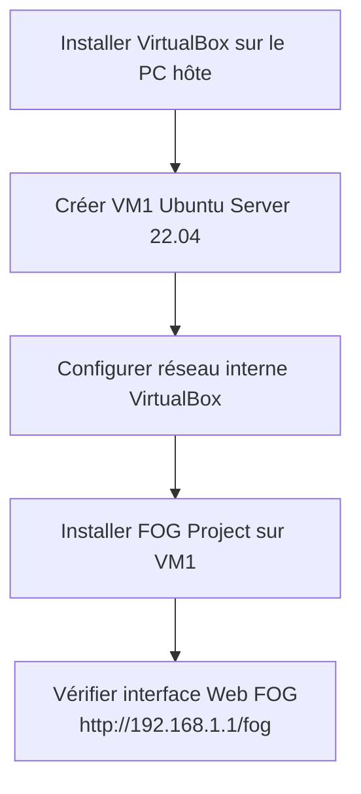
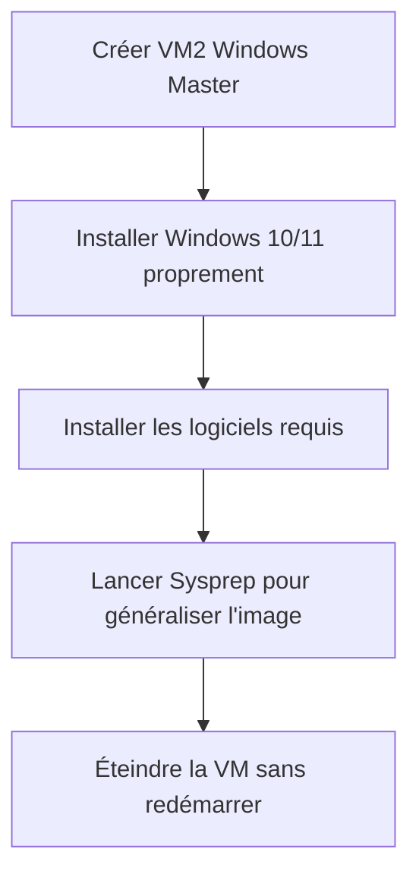
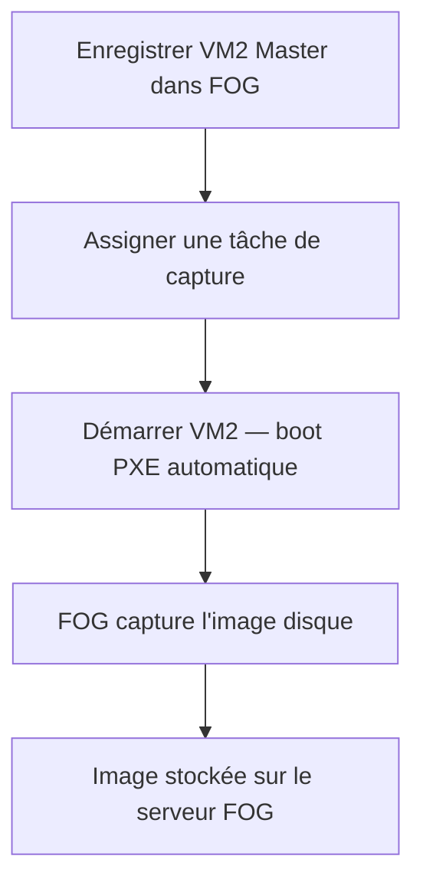
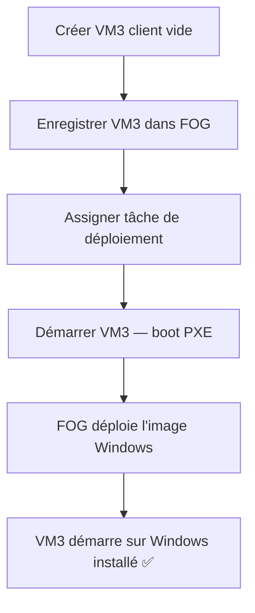
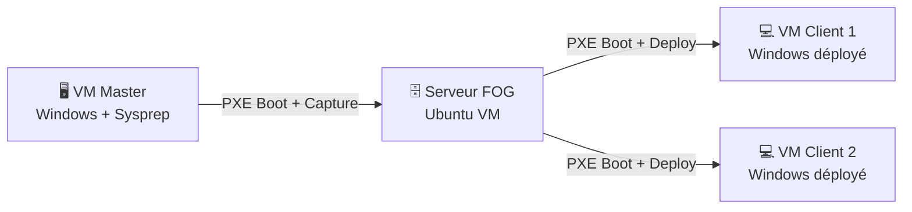

# Workflow — Déploiement FOG Project

---

## Linux ou Windows comme hôte ?

> [!tip] Recommandation : **Windows comme hôte**
> Pour un contexte étudiant, garder **Windows 10/11 comme OS hôte** avec **VirtualBox** est le meilleur compromis.
> Le serveur FOG tourne sur une VM Ubuntu — le reste des VMs est Windows.

| Critère | Hôte Windows | Hôte Linux |
|---|---|---|
| Familiarité | ✅ Plus accessible | ⚠️ Moins courant en cours |
| Performance VM | ✅ Bonne avec VirtualBox | ✅ Excellente avec KVM |
| Gestion réseau PXE | ✅ Réseau interne VirtualBox simple | ✅ Flexible |
| Conflits | ⚠️ Hyper-V doit être désactivé | ✅ Aucun conflit |
| FOG server | ✅ VM Ubuntu dans VirtualBox | ✅ VM Ubuntu dans VirtualBox |
| Clients Windows | ✅ VMs Windows dans VirtualBox | ✅ VMs Windows dans VirtualBox |
| Claude compatible | ✅ PowerShell + bash SSH | ✅ bash natif |

> [!warning] Point critique si hôte Windows
> **Désactiver Hyper-V** avant d'utiliser VirtualBox, sinon les VMs ne démarrent pas.
> ```powershell
> bcdedit /set hypervisorlaunchtype off
> # Redémarrer ensuite
> ```

---

## Architecture des VMs

```
┌─────────────────────────────────────────────┐
│         PC Hôte (Windows 10/11)             │
│              VirtualBox                     │
│                                             │
│  ┌──────────────────┐                       │
│  │ VM1 — FOG Server │  Ubuntu 22.04 LTS     │
│  │  IP: 192.168.1.1 │  FOG + DHCP + TFTP   │
│  └────────┬─────────┘                       │
│           │ Réseau interne VirtualBox        │
│    ┌──────┴──────┐                          │
│    │             │                          │
│  ┌─┴──────┐  ┌───┴────┐                    │
│  │ VM2    │  │  VM3   │  Windows 10/11      │
│  │ Master │  │ Client │  boot PXE           │
│  └────────┘  └────────┘                    │
└─────────────────────────────────────────────┘
```

> [!note] Configuration réseau VirtualBox
> Toutes les VMs doivent être sur le même **réseau interne** (Internal Network) dans VirtualBox.
> FOG gérera son propre serveur DHCP pour le PXE — ne pas utiliser NAT pour les clients.

---

## Workflow complet

### Phase 1 — Préparation de l'environnement



**Détail des étapes :**

- [ ] **Étape 1.1** — Installer VirtualBox (désactiver Hyper-V avant)
- [ ] **Étape 1.2** — Créer VM1 : Ubuntu Server 22.04 LTS
  - RAM : 2 Go minimum
  - Disque : 20go (stockage des images)
  - Réseau : Internal Network `fognet`
- [ ] **Étape 1.3** — Installer FOG Project sur VM1
  ```bash
  git clone https://github.com/FOGProject/fogproject.git
  cd fogproject/bin
  sudo bash installfog.sh
  ```
- [ ] **Étape 1.4** — Accéder à l'interface Web FOG et finaliser l'installation

---

### Phase 2 — Préparation de l'image Windows (VM Master)



**Détail des étapes :**

- [ ] **Étape 2.1** — Créer VM2 : Windows 10/11 (Master)
  - Réseau : Internal Network `fognet`
  - Ordre de boot : **Réseau en 1er**, puis disque
- [ ] **Étape 2.2** — Installer Windows et les logiciels voulus sur le master
- [ ] **Étape 2.3** — Lancer Sysprep pour généraliser l'image
  ```
  C:\Windows\System32\Sysprep\sysprep.exe
  → Entrer en mode OOBE
  → Cocher "Generalize"
  → Action d'arrêt : Shutdown
  ```
- [ ] **Étape 2.4** — La VM s'éteint automatiquement après Sysprep

---

### Phase 3 — Capture de l'image via FOG



**Détail des étapes :**

- [ ] **Étape 3.1** — Dans l'interface FOG : ajouter un hôte avec l'adresse MAC de VM2
- [ ] **Étape 3.2** — Créer une image dans FOG (nom, type : Single Disk)
- [ ] **Étape 3.3** — Assigner une tâche **Capture** à VM2
- [ ] **Étape 3.4** — Démarrer VM2 → elle boot en PXE → FOG capture automatiquement
- [ ] **Étape 3.5** — Attendre la fin de la capture (visible dans l'interface Web FOG)

---

### Phase 4 — Déploiement sur les VMs clientes



**Détail des étapes :**

- [ ] **Étape 4.1** — Créer VM3 : disque vide, réseau `fognet`, boot PXE en priorité
- [ ] **Étape 4.2** — Dans FOG : enregistrer VM3 avec son adresse MAC
- [ ] **Étape 4.3** — Assigner une tâche **Deploy** à VM3 avec l'image capturée
- [ ] **Étape 4.4** — Démarrer VM3 → boot PXE → déploiement automatique
- [ ] **Étape 4.5** — VM3 redémarre sur Windows opérationnel
- [ ] **Étape 4.6** — Répéter pour autant de VMs clientes que nécessaire

---

## Résumé visuel du flux complet



---

## Points de vigilance

> [!warning] Réseau
> - Toutes les VMs sur le **même réseau interne** VirtualBox
> - FOG gère son propre DHCP — ne pas activer le DHCP VirtualBox sur ce réseau
> - Vérifier que les VMs clients ont le **boot PXE activé en priorité**

> [!warning] Sysprep
> - Ne jamais redémarrer le master après Sysprep — capturer directement
> - Un master Sysprep ne peut être redémarré qu'une seule fois avant reconfiguration

> [!warning] Espace disque
> - Prévoir **au moins 20 Go** sur la VM FOG pour stocker les images
> - Une image Windows 10 compressée ≈ 8-15 Go sur le serveur FOG

---

## Liens

- [[Comparatif Technologies]]
- [[Analyse des risques]]
- [[Checklist de préparation]]
- [[Plan d'attaque Séance 1]]
